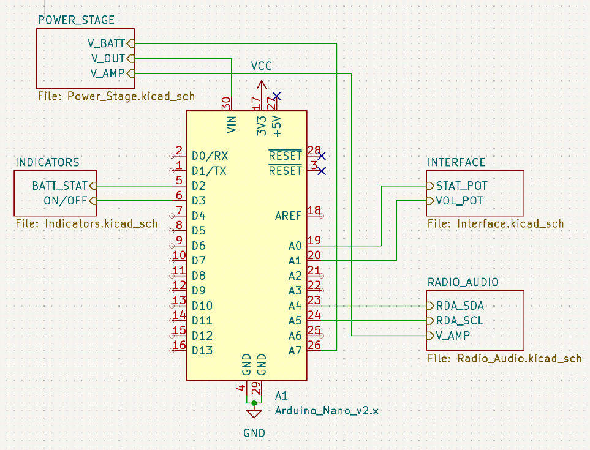
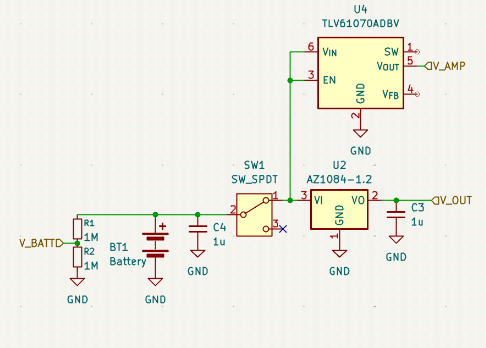
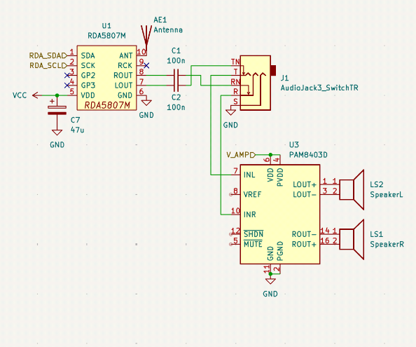
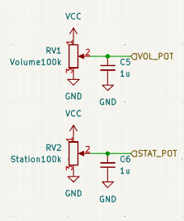
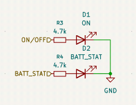

# Regency TR-1 Throwback
This is a throwback to the iconic Regency TR-1 portable radio, the first transistor radio to come in a small form factor. I am a huge retro tech fan and wanted to make something that feels like this but with modern parts.

## Schematic

This is the root of the schematic, the highest level of abstraction.

This is the power stage, it operates on 3xAA which provides 4.5V. The battery voltage is regulated into 3.3V for logic, and 5V for the amplifier. There is also a high-impedance divider to monitor charge.

This is the radio and audio stage, to streamline development, the RDA5807M module is used to make FM radio as easy as possible. The audio jack is a switching TRS jack, meaning that if no headphones are plugged in, the audio signal will go the speakers instead of the headphones. The amplifier is a PAM8403 evaluation board from DFRobot.

Uses potentiometers as a voltage divider to adjust values.

Some indicator LEDs

## Casing
TBA

## Building
Still in the design review process, I plan to implement this using stripboard and a lot of modules instead of a PCB to cut down on development time because JLCPCB takes a millenia to deliver its boards.

